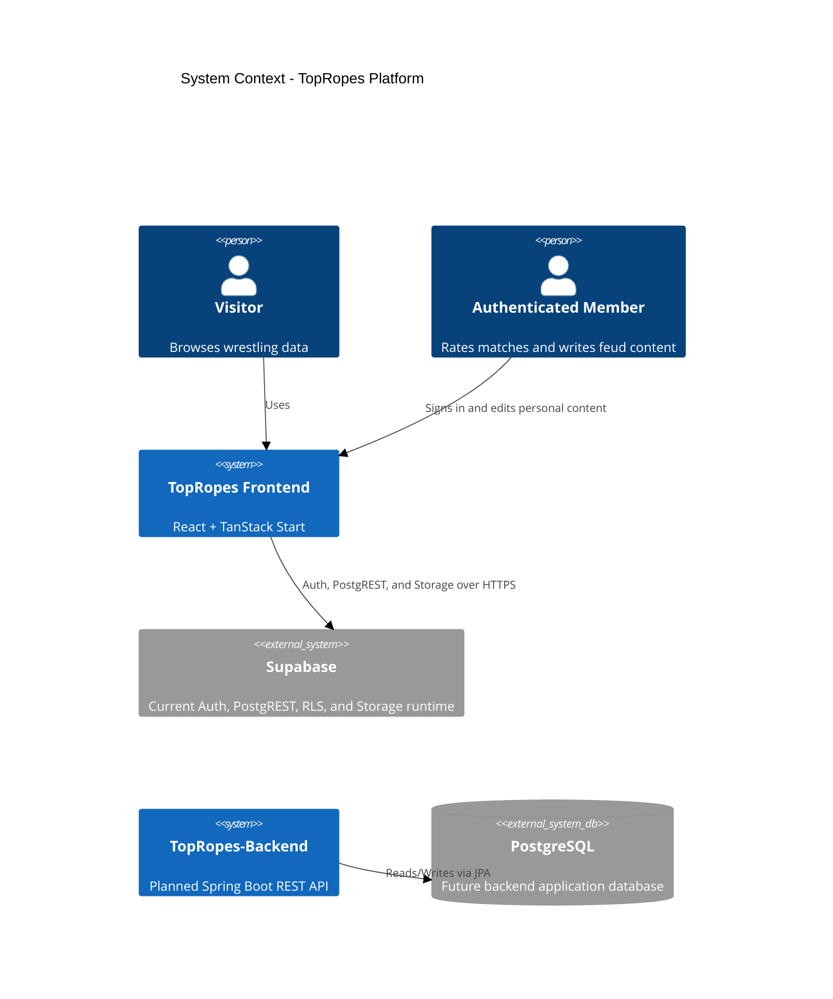
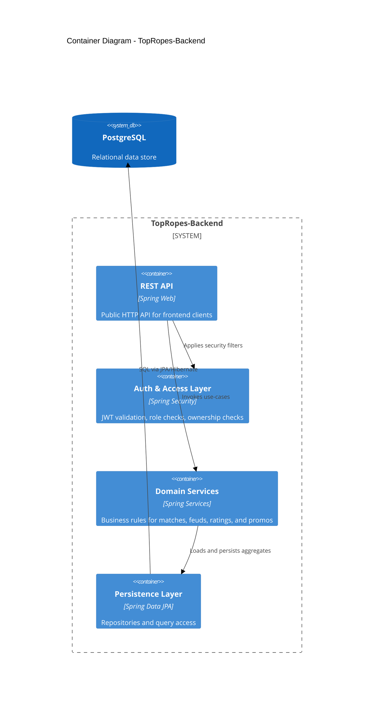

# TopRopes Backend Architecture

## Purpose

TopRopes-Backend is the planned Spring Boot replacement for the data access layer currently used by `ring-rumble-react`. It is not yet the runtime system of record: the frontend currently uses Supabase Auth and direct Supabase PostgREST and Storage calls.

## Architecture Goals

- Separate presentation (frontend) from data and business rules (backend).
- Preserve the frontend's current catalogue and user-content contracts during migration.
- Provide stable, versioned REST APIs for roster, events, matches, feuds, ratings, dossiers, promos, and editorial operations.
- Replace direct Supabase calls only after endpoint and authorization parity exists.
- Keep the username-first UI while making the identity-provider transition explicit.

## Responsibilities Split

| Layer | Responsibilities | What it must not do |
| --- | --- | --- |
| Frontend (ring-rumble-react) | UI rendering, navigation, local cache, Supabase calls | Implement backend business rules |
| Supabase (current runtime) | Auth, PostgREST tables, RLS, Storage | Own Spring API behavior |
| Backend (TopRopes-Backend) | Planned REST facade, domain logic, validation, authorization | Claim to be used by the current frontend before migration |
| PostgreSQL (backend) | Backend-owned durable storage for the future platform | Be treated as the current frontend database |

## C4 Context

## C4 Container

## Current Frontend Runtime

- Authentication is Supabase email/password behind a username-only UI. The frontend derives an internal email address from the username and persists the Supabase session in browser storage.
- Public catalogue reads use the `admin_events`, `admin_matches`, and `admin_wrestlers` tables. Static TypeScript catalogue modules remain an SSR/offline fallback and enrich records with fields not stored in Supabase.
- Authenticated user content uses `match_ratings`, `feud_dossiers`, and `feud_promos` with RLS ownership enforcement.
- The Data Desk permits every signed-in user to author records in the current development mode. Authors or users with the Supabase `admin` role may update and delete those records.
- Wrestler images are stored in the `wrestler-images` Supabase bucket; the UI accepts PNG and SVG files up to 2 MiB.

## Planned Backend Component View

### API Layer

- Catalog endpoints: promotions, wrestlers, events, matches, feuds.
- User content endpoints: ratings, feud dossiers, feud promos.
- Editorial endpoints for managing events, matches, and wrestlers with the same CRUD capabilities as the Data Desk.

### Domain Services

- Match service: match search, detail projection, card relationships.
- Feud service: feud timeline, heat calculations, dossier baseline merges.
- Rating service: per-user scoring lifecycle and aggregate computations.
- Identity adapter: a migration decision is required before the backend can replace Supabase Auth. It must either validate Supabase access tokens or move the frontend to backend-issued sessions.

### Persistence

- JPA entities for relational mapping.
- Migration-driven schema management (recommended: Flyway).
- Explicit unique constraints for user-scoped records.

## API Parity Contract

- Public read API: browse roster/events/matches/feuds.
- Authenticated API: create/update/delete ratings, dossiers, promos.
- Editorial API: list, create, update, and delete events, matches, and wrestlers. Current UI policy is author-or-admin, not admin-only.

## Integration Status

`docs/openapi.yaml` is the intended REST compatibility contract for the current frontend behavior. It is not evidence that the frontend calls these endpoints or that every endpoint is implemented in the current Spring application.

1. Preserve Supabase behavior while the contract is implemented and tested.
2. Add a frontend API client that maps camelCase API fields to the current UI models.
3. Choose the identity bridge: validate Supabase JWTs in Spring, or migrate the frontend to backend-issued access and refresh tokens.
4. Move catalogue, ratings, dossiers, promos, image upload, and Data Desk operations one feature at a time.
5. Remove direct Supabase access only after production parity and data migration are verified.

## Identity Contract

- The frontend collects `username` + `password`; it currently converts the username to an internal Supabase email address.
- The backend's existing username/password endpoints issue backend JWTs, which the current frontend neither requests nor stores.
- Backend JWTs and Supabase JWTs are not interchangeable. Protected endpoints cannot be integrated until an explicit token-validation strategy is implemented.
- User-facing identifiers remain stable usernames; Supabase and backend user IDs are UUIDs.

## Initial Non-Functional Targets

- Stateless API deployment.
- Backward-compatible API versioning.
- Structured logging and request correlation IDs.
- Test layers: controller, service, repository integration tests.
