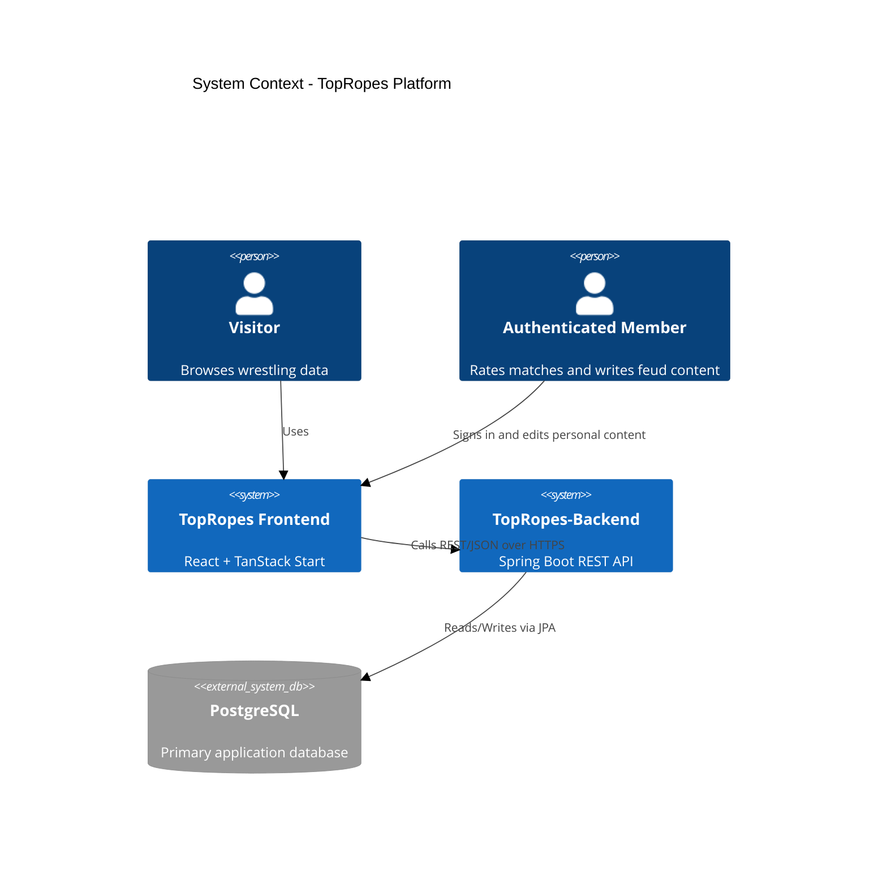
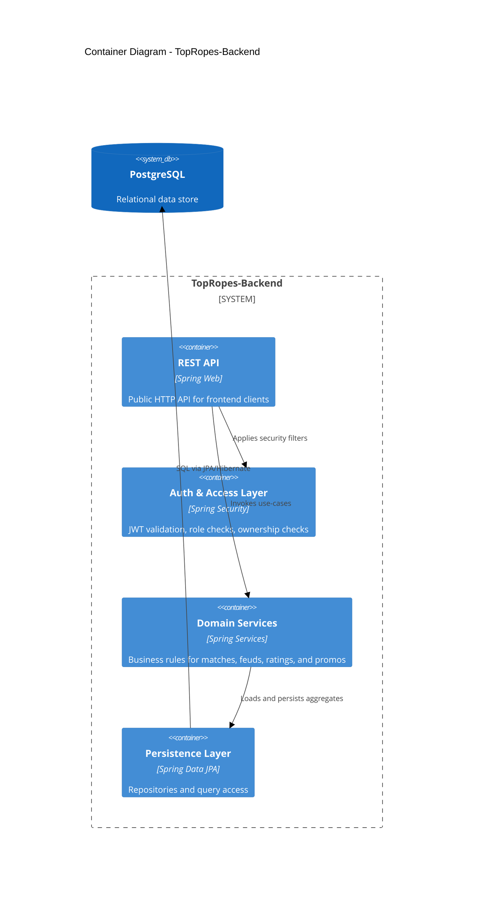

# TopRopes Backend Architecture

## Purpose

TopRopes-Backend is the new system of record for the TopRopes frontend. It moves domain and user data out of the React application and into a dedicated backend built with Java, Spring Boot, Gradle, and PostgreSQL.

## Architecture Goals

- Separate presentation (frontend) from data and business rules (backend).
- Replace frontend-seeded domain data with persistent backend data.
- Provide stable, versioned APIs for roster, events, matches, feuds, ratings, and feud authoring.
- Enforce authorization and data ownership in one place.
- Keep identity username-first with no email required for account creation or sign-in.

## Responsibilities Split

| Layer | Responsibilities | What it must not do |
| --- | --- | --- |
| Frontend (ring-rumble-react) | UI rendering, navigation, optimistic UX state, form handling | Persist authoritative data directly |
| Backend (TopRopes-Backend) | Domain logic, validation, authorization checks, API contracts | UI rendering concerns |
| Database (PostgreSQL) | Durable storage, relational integrity, constraints, indexing | Business workflows in ad-hoc client logic |

## C4 Context

## C4 Container

## Component View

### API Layer

- Catalog endpoints: promotions, wrestlers, events, matches, feuds.
- User content endpoints: ratings, feud dossiers, feud promos.
- Admin/editorial endpoints for managing canonical wrestling content.

### Domain Services

- Match service: match search, detail projection, card relationships.
- Feud service: feud timeline, heat calculations, dossier baseline merges.
- Rating service: per-user scoring lifecycle and aggregate computations.
- Identity service: username registration, credential verification, and token issuance.

### Persistence

- JPA entities for relational mapping.
- Migration-driven schema management (recommended: Flyway).
- Explicit unique constraints for user-scoped records.

## Proposed API Boundaries

- Public read API: browse roster/events/matches/feuds.
- Authenticated API: create/update/delete ratings, dossiers, promos.
- Privileged editorial API: curate baseline data currently hardcoded in frontend modules.

## Integration Contract with Frontend

The frontend should progressively migrate from in-repo TypeScript seed data to backend reads:

1. Read catalog data from backend endpoints.
2. Keep local UI state and caching in frontend.
3. Persist user-generated data only through backend APIs.
4. Remove direct DB access from frontend once migration is complete.

## Identity Contract

- The backend accepts `username` + `password` credentials only.
- Email is not required, not collected in API payloads, and not used as login identity.
- User-facing identifiers remain stable usernames; internal records use UUID primary keys.

## Initial Non-Functional Targets

- Stateless API deployment.
- Backward-compatible API versioning.
- Structured logging and request correlation IDs.
- Test layers: controller, service, repository integration tests.
