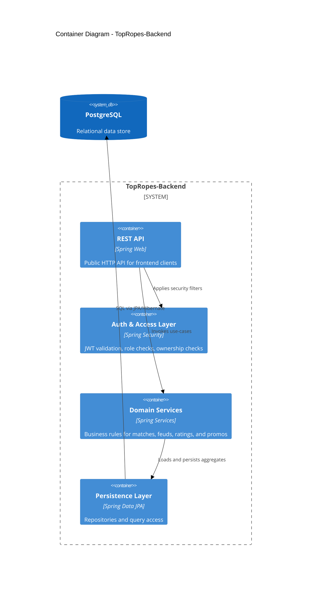

# TopRopes Backend Architecture

## Purpose

TopRopes-Backend is the Spring Boot runtime system of record for `ring-rumble-react`.

## Architecture Goals

- Separate presentation (frontend) from data and business rules (backend).
- Preserve the frontend catalogue and user-content contracts.
- Provide stable, versioned REST APIs for roster, events, matches, feuds, ratings, dossiers, promos, and editorial operations.
- Serve all frontend data access through versioned REST endpoints.
- Keep the username-first UI with backend-issued access and refresh tokens.

## Responsibilities Split

| Layer | Responsibilities | What it must not do |
| --- | --- | --- |
| Frontend (ring-rumble-react) | UI rendering, navigation, local cache, REST calls | Implement backend business rules |
| Backend (TopRopes-Backend) | REST facade, domain logic, validation, authorization | Expose database credentials to the browser |
| PostgreSQL | Backend-owned durable storage | Be accessed directly by the frontend |

## C4 Context

## C4 Container

## Frontend Runtime

- Authentication uses backend-issued JWT access and refresh tokens persisted by the frontend.
- Public catalogue reads use catalog REST endpoints; static TypeScript modules remain an SSR/offline fallback.
- Authenticated user content is protected by service-level ownership checks.
- The Data Desk is restricted to `ROLE_ADMIN` endpoints.
- Wrestler images are stored by the backend and served from catalog image endpoints; PNG uploads are limited to 2 MiB.

## Backend Component View

### API Layer

- Catalog endpoints: promotions, wrestlers, events, matches, feuds.
- User content endpoints: ratings, feud dossiers, feud promos.
- Editorial endpoints for managing events, matches, and wrestlers with the same CRUD capabilities as the Data Desk.

### Domain Services

- Match service: match search, detail projection, card relationships.
- Feud service: feud timeline, heat calculations, dossier baseline merges.
- Rating service: per-user scoring lifecycle and aggregate computations.
- Identity service: username/password authentication with BCrypt hashes and backend-issued JWT sessions.

### Persistence

- JPA entities for relational mapping.
- Migration-driven schema management (recommended: Flyway).
- Explicit unique constraints for user-scoped records.

## API Parity Contract

- Public read API: browse roster/events/matches/feuds.
- Authenticated API: create/update/delete ratings, dossiers, promos.
- Editorial API: list, create, update, and delete events, matches, and wrestlers, restricted to `ROLE_ADMIN`.

## Integration Status

`docs/openapi.yaml` describes the REST compatibility contract used by the frontend.

## Identity Contract

- The frontend collects `username` + `password` and stores backend-issued JWT tokens.
- User-facing identifiers remain stable usernames; backend user IDs are UUIDs.

## Initial Non-Functional Targets

- Stateless API deployment.
- Backward-compatible API versioning.
- Structured logging and request correlation IDs.
- Test layers: controller, service, repository integration tests.
