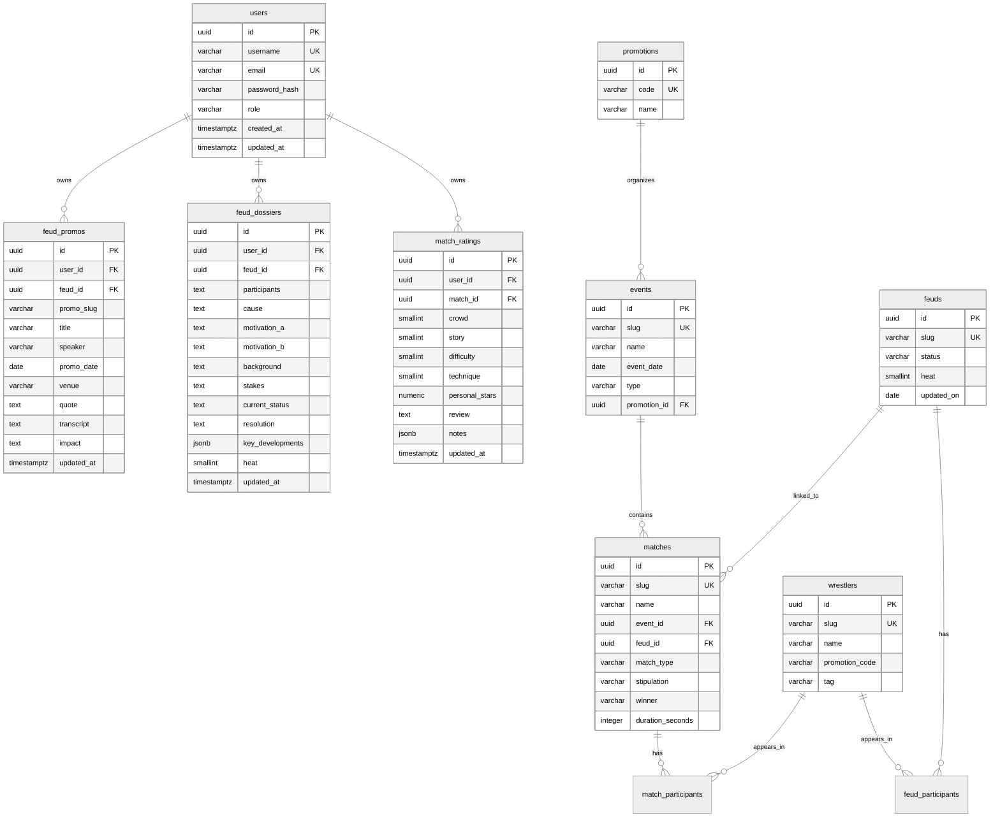

# TopRopes Backend Data Model

## Design Principle

Data ownership moves to backend-controlled PostgreSQL schemas. Frontend is a consumer, not an authority.

## Schema Split

- `catalog` schema: canonical wrestling content.
- `identity` schema: users and access metadata.
- `community` schema: user-generated ratings and feud authoring content.

## Entity Relationship Diagram

## Constraints

- `match_ratings`: unique `(user_id, match_id)`.
- `feud_dossiers`: unique `(user_id, feud_id)`.
- `feud_promos`: unique `(user_id, feud_id, promo_slug)`.
- Slugs are unique for external API identity.

## Migration from Frontend Data

- Move `roster`, `events`, `matches`, and `feuds` from frontend modules into `catalog` tables.
- Preserve existing slugs to avoid route breaks.
- Backfill user records from existing auth provider during transition if needed.
