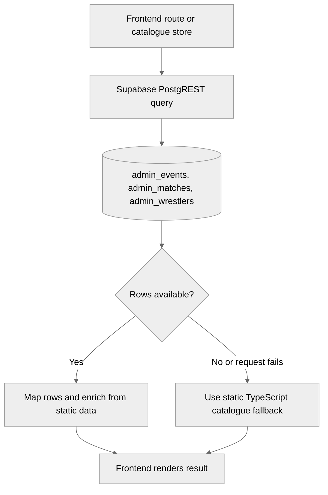
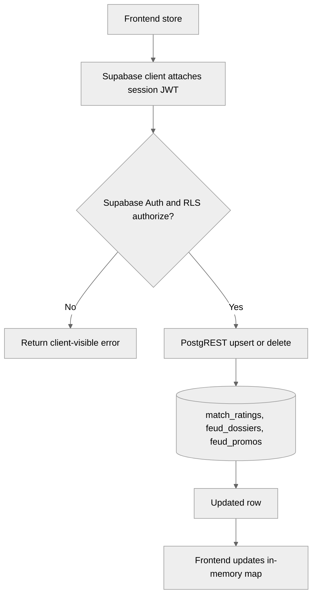
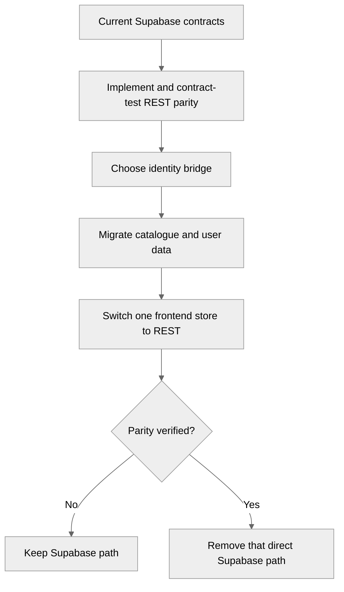

# TopRopes Backend Flowchart

## Current Read Flow (Catalogue)

```mermaid
%%{init: {'theme': 'neutral'}}%%
flowchart TD
  A[Frontend route or catalogue store] --> B[Supabase PostgREST query]
  B --> C[(admin_events, admin_matches, admin_wrestlers)]
  C --> D{Rows available?}
  D -- Yes --> E[Map rows and enrich from static data]
  D -- No or request fails --> F[Use static TypeScript catalogue fallback]
  E --> G[Frontend renders result]
  F --> G
```

## Current Write Flow (User Content)

```mermaid
%%{init: {'theme': 'neutral'}}%%
flowchart TD
  A[Frontend store] --> B[Supabase client attaches session JWT]
  B --> C{Supabase Auth and RLS authorize?}
  C -- No --> D[Return client-visible error]
  C -- Yes --> E[PostgREST upsert or delete]
  E --> F[(match_ratings, feud_dossiers, feud_promos)]
  F --> G[Updated row]
  G --> H[Frontend updates in-memory map]
```

## Planned REST Migration Flow

```mermaid
%%{init: {'theme': 'neutral'}}%%
flowchart TD
  A[Current Supabase contracts] --> B[Implement and contract-test REST parity]
  B --> C[Choose identity bridge]
  C --> D[Migrate catalogue and user data]
  D --> E[Switch one frontend store to REST]
  E --> F{Parity verified?}
  F -- No --> G[Keep Supabase path]
  F -- Yes --> H[Remove that direct Supabase path]
```
