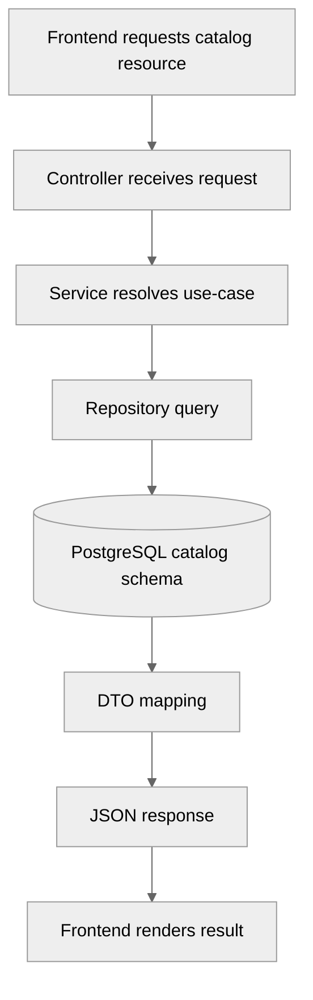
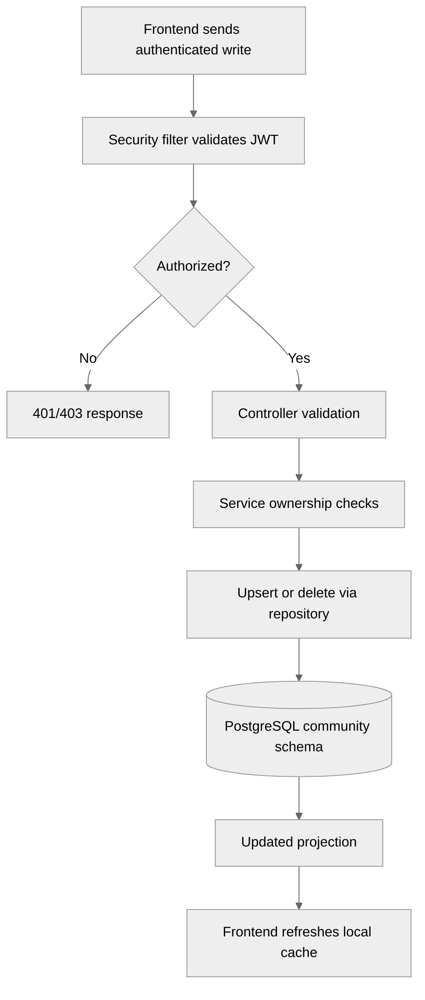
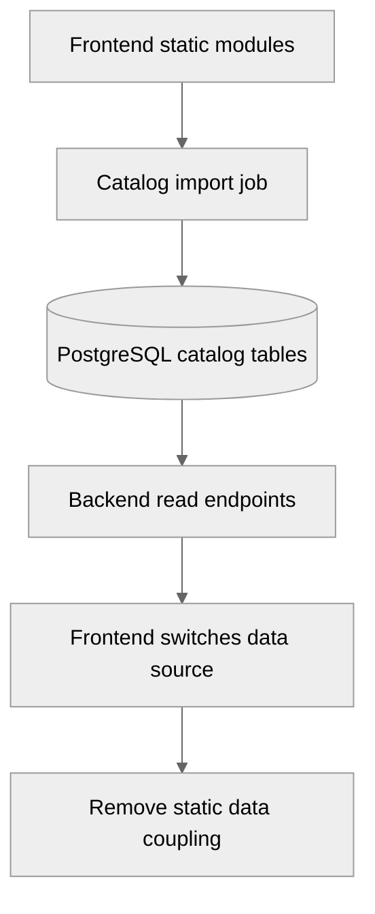

# TopRopes Backend Flowchart

## Read Flow (Catalog)

```mermaid
%%{init: {'theme': 'neutral'}}%%
flowchart TD
  A[Frontend requests catalog resource] --> B[Controller receives request]
  B --> C[Service resolves use-case]
  C --> D[Repository query]
  D --> E[(PostgreSQL catalog schema)]
  E --> F[DTO mapping]
  F --> G[JSON response]
  G --> H[Frontend renders result]
```

## Write Flow (User Content)

```mermaid
%%{init: {'theme': 'neutral'}}%%
flowchart TD
  A[Frontend sends authenticated write] --> B[Security filter validates JWT]
  B --> C{Authorized?}
  C -- No --> D[401/403 response]
  C -- Yes --> E[Controller validation]
  E --> F[Service ownership checks]
  F --> G[Upsert or delete via repository]
  G --> H[(PostgreSQL community schema)]
  H --> I[Updated projection]
  I --> J[Frontend refreshes local cache]
```

## Migration Flow

```mermaid
%%{init: {'theme': 'neutral'}}%%
flowchart TD
  A[Frontend static modules] --> B[Catalog import job]
  B --> C[(PostgreSQL catalog tables)]
  C --> D[Backend read endpoints]
  D --> E[Frontend switches data source]
  E --> F[Remove static data coupling]
```
