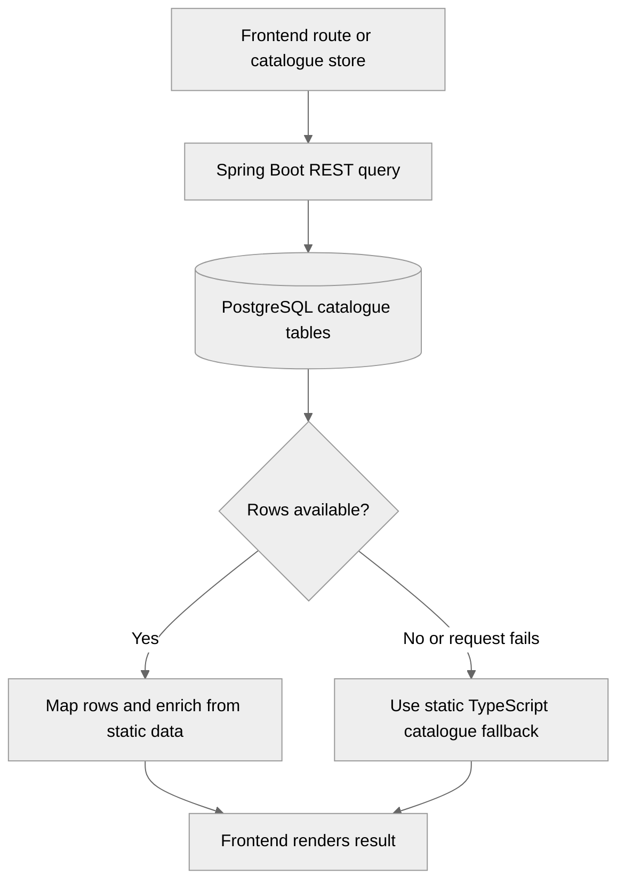
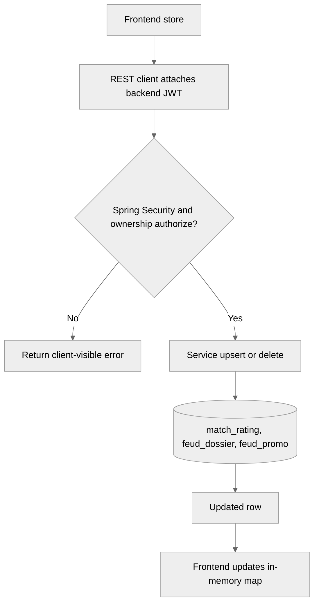
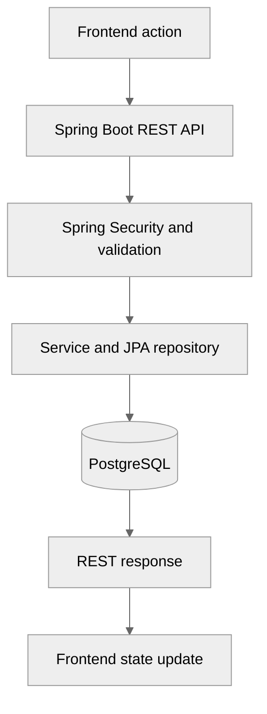

# TopRopes Backend Flowchart

## Catalogue Read Flow

```mermaid
%%{init: {'theme': 'neutral'}}%%
flowchart TD
  A[Frontend route or catalogue store] --> B[Spring Boot REST query]
  B --> C[(PostgreSQL catalogue tables)]
  C --> D{Rows available?}
  D -- Yes --> E[Map rows and enrich from static data]
  D -- No or request fails --> F[Use static TypeScript catalogue fallback]
  E --> G[Frontend renders result]
  F --> G
```

## User Content Write Flow

```mermaid
%%{init: {'theme': 'neutral'}}%%
flowchart TD
  A[Frontend store] --> B[REST client attaches backend JWT]
  B --> C{Spring Security and ownership authorize?}
  C -- No --> D[Return client-visible error]
  C -- Yes --> E[Service upsert or delete]
  E --> F[(match_rating, feud_dossier, feud_promo)]
  F --> G[Updated row]
  G --> H[Frontend updates in-memory map]
```

## REST Runtime Flow

```mermaid
%%{init: {'theme': 'neutral'}}%%
flowchart TD
  A[Frontend action] --> B[Spring Boot REST API]
  B --> C[Spring Security and validation]
  C --> D[Service and JPA repository]
  D --> E[(PostgreSQL)]
  E --> F[REST response]
  F --> G[Frontend state update]
```
