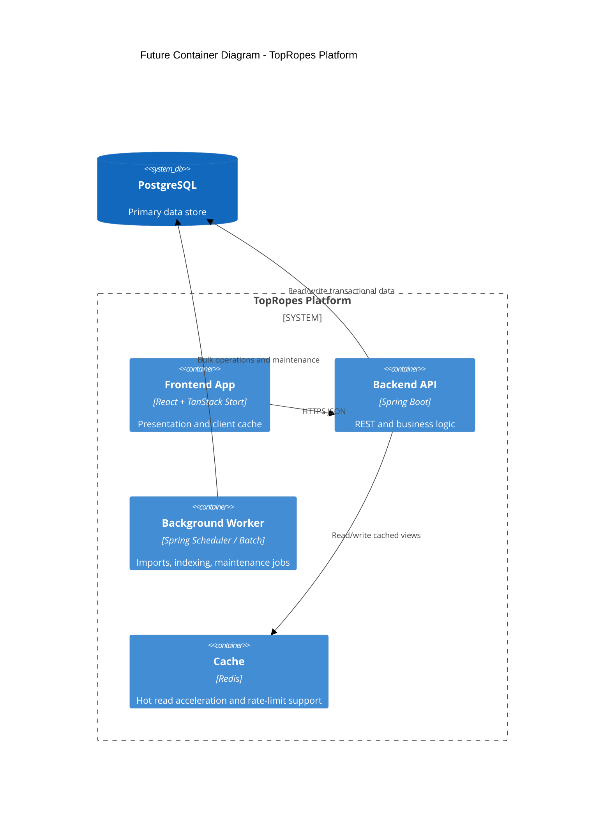

# Future Architecture

## Target State

TopRopes will run as a decoupled frontend-backend platform where:

- Frontend focuses on UX, routing, and caching.
- TopRopes-Backend owns all domain logic and persistence.
- PostgreSQL is the authoritative store for both catalog and user content.

## Evolution Roadmap

1. Catalog API parity
- Implement read endpoints for roster, events, matches, and feuds.
- Switch frontend read paths from local modules to backend API.

2. User content API hardening
- Implement ratings/dossiers/promos endpoints with ownership checks.
- Standardize pagination, filtering, and error contracts.

3. Editorial operations
- Add role-based editorial CRUD endpoints.
- Add import/export jobs for seeded and curated content.

4. Platform resilience
- Introduce caching, read replicas (if needed), and observability dashboards.
- Add backward-compatible API versioning policy.

## Future Container Additions

