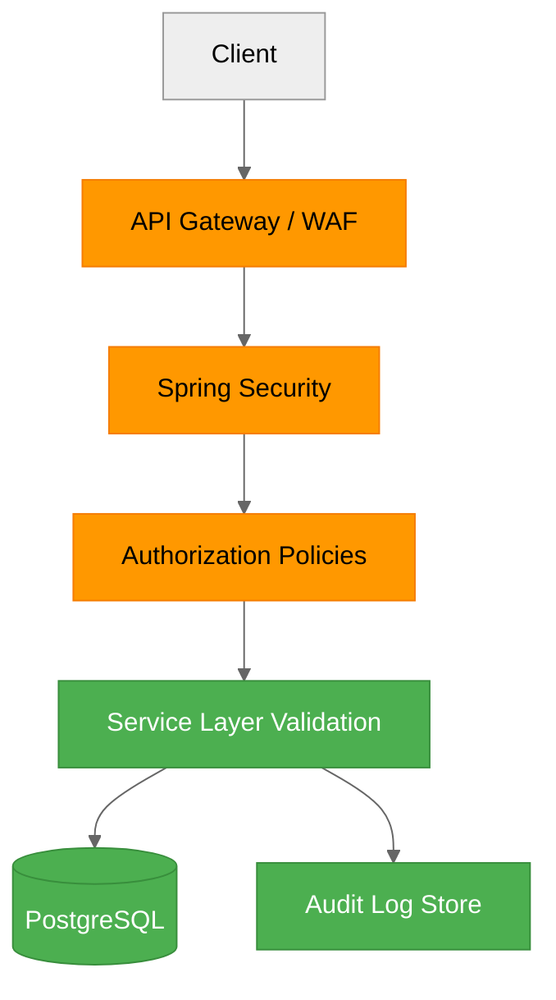

# Future Security Architecture

## Target Security Posture

The future backend security model strengthens identity assurance, authorization depth, and operational visibility.

## Planned Enhancements

- Username-first authentication with short-lived access tokens.
- Refresh token rotation and revocation.
- Fine-grained permission model for editorial and moderation actions.
- Rate-limits per identity and endpoint class.
- Immutable audit logs for sensitive writes.
- Automated dependency and container vulnerability scanning.

## Future Trust and Control Layers

## Future Security Operations

- Security alerts wired to SIEM-compatible sinks.
- Periodic access review for elevated roles.
- Recovery playbooks for token leakage and credential compromise.
