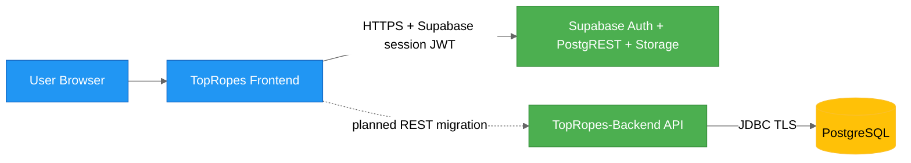

# TopRopes Backend Security Architecture

## Status

This document distinguishes the current frontend runtime from the planned Spring Boot security model. `ring-rumble-react` currently calls Supabase directly; it does not call TopRopes-Backend.

## Trust Boundaries

## Defense-in-Depth

| Layer | Controls |
| --- | --- |
| Network | HTTPS, reverse proxy/WAF, rate limiting |
| Identity | Current: Supabase Auth session JWT persisted by the Supabase client. Planned: an explicit Supabase-token validation or backend-token migration strategy. |
| Authorization | Current: Supabase RLS using `auth.uid()` plus `has_role`. Planned: equivalent ownership and author-or-admin checks. |
| Application | Bean validation, standardized error mapping, input sanitization |
| Data | Least-privilege DB user, schema constraints, transactional integrity |
| Observability | Audit logs for write endpoints, security event logging |

## Current Authentication and Authorization Model

- The UI collects `username` + `password`, then derives an internal email for Supabase Auth. That email is an implementation detail and is never shown to users.
- Supabase owns signup, signin, signout, refresh, session persistence, and bearer token issuance.
- Public reads are permitted for the editorial catalogue tables.
- Ratings, dossiers, and promos are protected by RLS and belong to the authenticated user.
- The Data Desk currently allows every signed-in user to create records; only the author or a Supabase `admin` can update or delete them.
- Browser uploads are limited by the UI to PNG and SVG wrestler portraits no larger than 2 MiB. Storage bucket policy enforcement must remain server-side.

## Planned Backend Model

- The existing Spring security filter validates only JWTs signed with the backend secret. It does not validate Supabase JWTs.
- Backend login endpoints therefore cannot be enabled for the current UI without a frontend auth migration.
- REST endpoints must preserve the frontend's author-or-admin editorial rule, rather than applying admin-only access to all authoring operations.
- CORS must permit every deployed frontend origin; the current local-only `http://localhost:5173` allowlist is insufficient for non-local deployment.

## Sensitive Operations

- Create/update/delete ratings.
- Create/update/delete feud dossiers and promos.
- Editorial content mutation and wrestler image upload.

## Security Backlog (Planned)

- Decide and implement the Supabase-to-Spring identity bridge.
- Match Supabase RLS author-or-admin rules in the Java authorization layer.
- Add upload authorization, MIME verification, and object-size enforcement to the backend image API.
- Add immutable audit trail for editorial mutations.
