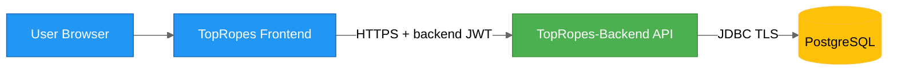

# TopRopes Backend Security Architecture

## Status

`ring-rumble-react` calls TopRopes-Backend for authentication, catalogue access, user content, and uploads.

## Trust Boundaries

## Defense-in-Depth

| Layer | Controls |
| --- | --- |
| Network | HTTPS, reverse proxy/WAF, rate limiting |
| Identity | Backend-issued access and refresh JWTs persisted by the frontend client. |
| Authorization | Spring Security roles plus service-level ownership checks. |
| Application | Bean validation, standardized error mapping, input sanitization |
| Data | Least-privilege DB user, schema constraints, transactional integrity |
| Observability | Audit logs for write endpoints, security event logging |

## Authentication and Authorization Model

- The UI collects `username` + `password` for the Spring Boot auth endpoints.
- The backend owns signup, signin, signout, refresh, password hashing, and bearer token issuance.
- Public reads are permitted for the editorial catalogue tables.
- Ratings, dossiers, and promos belong to the authenticated user and are scoped in services.
- The Data Desk requires `ROLE_ADMIN` for catalogue mutation.
- Browser uploads are limited to PNG wrestler portraits no larger than 2 MiB and are verified server-side.

## Backend Model

- The Spring security filter validates JWTs signed with the backend secret.
- The frontend stores backend-issued access and refresh tokens.
- REST endpoints restrict editorial mutation to administrators.
- CORS must permit every deployed frontend origin; the current local-only `http://localhost:5173` allowlist is insufficient for non-local deployment.

## Sensitive Operations

- Create/update/delete ratings.
- Create/update/delete feud dossiers and promos.
- Editorial content mutation and wrestler image upload.

## Security Backlog

- Add immutable audit trail for editorial mutations.
