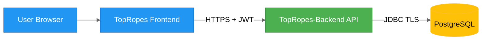

# TopRopes Backend Security Architecture

## Trust Boundaries

## Defense-in-Depth

| Layer | Controls |
| --- | --- |
| Network | HTTPS, reverse proxy/WAF, rate limiting |
| Identity | JWT authentication, token expiry enforcement |
| Authorization | Role-based checks and resource ownership validation |
| Application | Bean validation, standardized error mapping, input sanitization |
| Data | Least-privilege DB user, schema constraints, transactional integrity |
| Observability | Audit logs for write endpoints, security event logging |

## Authentication and Authorization Model

- Spring Security validates bearer tokens on protected endpoints.
- Login credentials are `username` + `password`; email is not part of the auth flow.
- Public endpoints are read-only catalog endpoints.
- User endpoints require authenticated principal and ownership checks.
- Admin/editorial endpoints require elevated role (for example `ROLE_EDITOR` or `ROLE_ADMIN`).

## Sensitive Operations

- Create/update/delete ratings.
- Create/update/delete feud dossiers and promos.
- Editorial content mutation (matches/events/feuds/wrestlers).

## Security Backlog (Planned)

- Introduce refresh token strategy and rotation.
- Add brute-force protection on username/password authentication endpoints.
- Add immutable audit trail for moderation and admin actions.
- Add secrets management integration for environment credentials.
